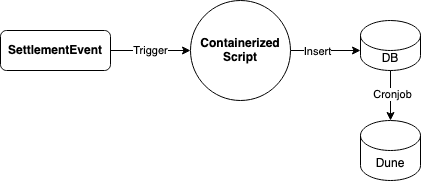

# Web3 Event ETL

Following this diagram



1. Some Web3 Event occurs (`SettlementEvent`)
2. An independent/external service (such as [Tenderly Web3 Actions](https://tenderly.co/web3-actions)) triggers script
   defined by `docker/Dockerfile.script` passing the relevant arguments.
3. Script Processes Event Data and Inserts into DB.

Note that:

- script image will have ENV vars "baked" in (API keys & DB credentials). So this image would have to be private.

## Build & Run

### Database

```shell
docker build -f docker/Dockerfile.db -t db-image .
docker run -d --network=host db-image
```

### Script Container

```shell
# Build
docker build -f ./docker/Dockerfile.script -t script-image .
# Run (requires DB running on localhost)!
docker run -d --network=host script-image --tx-hash 0x1
```

Alternatively, you can use the bash script:

```shell
./process_tx.sh 0x5
```

You can now run the script-image as many times as you like with whatever string you'd like to insert.

## Triggering Script Image

Tenderly Web3 Actions provides a serverless Smart Contract event listener from which one can execute actions defined in
Typescript. In particular, from typescript one can execute bash commands such as

```ts
const { exec } = require("child_process");

exec("docker run -d --network=host script-image --tx-hash 0x1", (error, stdout, stderr) => {
    if (error) {
        console.log(`error: ${error.message}`);
        return;
    }
    if (stderr) {
        console.log(`stderr: ${stderr}`);
        return;
    }
    console.log(`stdout: ${stdout}`);
});
```

